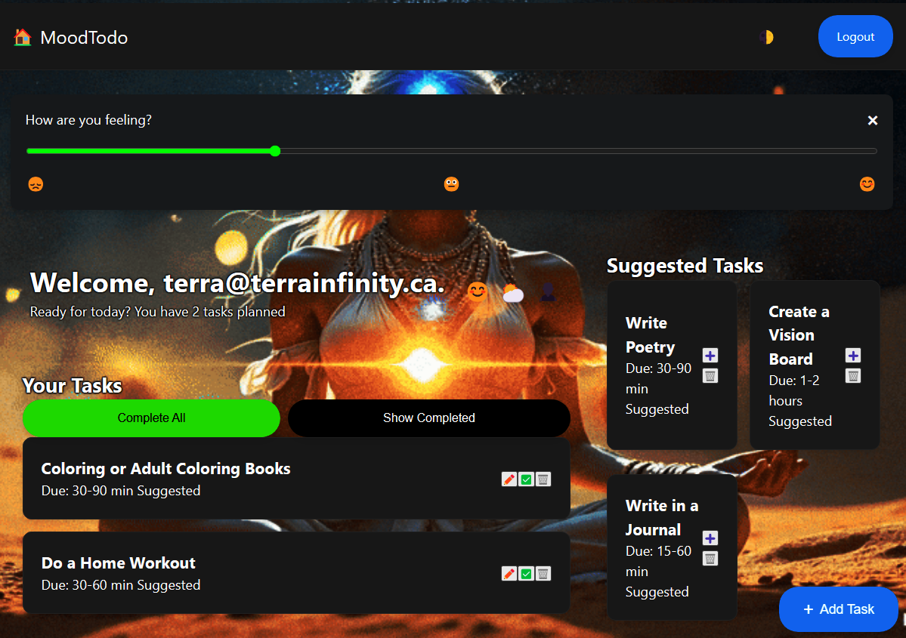

# MoodTodo - A Mood and Weather-Based Task Manager
<a href="https://mood-based-todo-app.netlify.app/" target="_blank" rel="noopener noreferrer">Click here for live website</a>

MoodTodo - A Mood and Weather-Based Task Manager
MoodTodo Preview 
image.png
Description
MoodTodo is an innovative task management web application that adapts to your emotional state and local weather conditions to suggest context-aware activities. Built with vanilla JavaScript and modern CSS, it features user authentication, dynamic task suggestions, and a delightful user experience.

Key Features
- **Static Design**: Login and Home pages designed for visual appeal and responsiveness.
- **Mood Selector**: A static component for mood selection.
- **Task Component**: Placeholder for displaying tasks.
- **Task Creation Form**: Static form for task entry.
- **Responsive Design**: Built for various screen sizes using CSS techniques.

git clone https://github.com/TerraInfinity/metana-fullstack-bootcamp.git
- Open `index.html` in a modern web browser to view the static layout.
- Or: <a href="https://mood-based-todo-app.netlify.app/" target="_blank" rel="noopener noreferrer">Click here for live website</a>

Usage
Add Tasks: Click the floating "+" button

Set Mood: Click the smiley icon 😊 and use the slider

Check Weather: Click the weather icon for current conditions

Toggle Theme: Click the moon/sun icon 🌓

User Accounts:

Register with email/password

Guest mode available with local storage

Project Structure
moodtodo/
├── public/ # Publicly accessible files
│ ├── data/ # Contains data files
│ │ └── suggested-tasks-pool.json # JSON file with task templates
│ ├── images/ # Directory for images used in the app
│ └── favicon.ico # Favicon for the application
├── src/ # Source files for the application
│ ├── auth.js # Handles user authentication logic
│ ├── script.js # Main application logic and event handling
│ ├── mood-task-service.js # Engine for generating mood-based task suggestions
│ ├── components/ # Directory for reusable components
│ │ ├── task-component.html # HTML template for task cards
│ │ └── mood-selector.html # HTML template for mood selection
│ └── css/ # Stylesheets for the application
│ ├── styles.css # Main styles for the application
│ └── components.css # Styles specific to components
├── index.html # Main entry point of the application
├── login.html # Modal for user authentication
├── README.md # Project documentation
├── LICENSE # License information
├── .gitignore # Specifies files to ignore in version control
└── netlify.toml # Configuration for Netlify deployment

Customization
Modify Suggested Tasks:
Edit public/data/suggested-tasks-pool.json:

Dependencies
jQuery 3.6.0
jQuery UI 1.12.1

Security Note
🔐 Important: This implementation stores passwords in plain text. For production use, implement:

License
Distributed under the MIT License. See LICENSE for more information.

Happy Tasking! 🚀
Let your mood and weather guide your productivity journey!